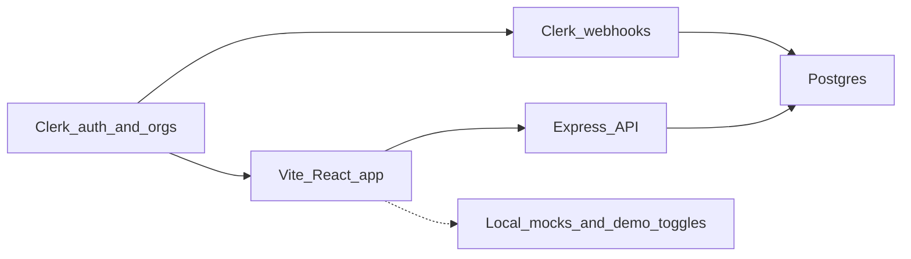

# Kriri — complete remaining-work spec

This is the full list of what still needs to be done from **the current stage of the repo** at `/Users/jones/Downloads/kriri`. It is not a greenfield product brief. Keep the existing dark Linear-inspired UI, Clerk auth, Express API, and Postgres. Finish wiring, data model, and polish so every screen that already exists actually works.

**Antigravity:** start at section 0 (how to work), then execute section 8 using sections 2–7 as the checklist. Do not skip section 0.

On implementation, move the agent workspace root to that folder before any edits.

**Explicitly out of scope** (landing-page marketing, not in the current app): AI insights, WebSockets/true real-time, offline local-first, billing, desktop app download, “thousands of teams.” Do not build those unless requested later.

---

## 0. Instructions for Antigravity

This section is the operating manual. Antigravity must follow it while executing every item in sections 1–10. The rest of this file is the **what**. This section is the **how**.

### 0.1 Who you are and where you work

You are implementing remaining work on an existing project tracker named **Kriri**, not starting a new app.

- **Repo root:** `/Users/jones/Downloads/kriri`
- **Frontend:** `frontend/` (Vite + React, `npm run dev` on 5173, proxies `/api` to 5001)
- **Backend:** `backend/` (Express, `npm run dev` / `nodemon src/app.js` on **5001**)
- Open this folder as the workspace **before** any edits. Do not create a parallel copy of the project.

Read this entire file once. Then execute **section 8 order** only. Do not skip to UI polish while the schema still cannot store what the create-project modal sends.

### 0.2 Non-negotiable constraints

- **Do not redesign.** Keep the dark Linear-inspired UI, Geist, Tailwind 4 tokens, `frontend/src/registry/` components, and existing pickers (`StatusPicker`, `LeadPicker`, `MemberPicker`, list/board/timeline renderers).
- **Do not rewrite** large files from scratch (`Projects.jsx` is huge on purpose). Make surgical edits.
- **Do not add** AI, WebSockets, offline/local-first, billing, a desktop app, Redis, GraphQL, Prisma, or a new frontend framework.
- **Do not change** Clerk as identity. Workspaces stay Clerk organizations. Do not reintroduce JWT/bcrypt login.
- **Do not commit secrets.** Never commit `.env`. Never print Clerk secret keys or dump `error.stack` to API clients.
- **Do not invent product surfaces** that are not already in the UI, except the small tables/endpoints this spec names (`project_members`, summary endpoint, comment PATCH/DELETE, task DELETE).
- If a button is dead and this spec says hide-or-implement: **hide it** unless the implementation is a few hours and listed here (milestones, issues on project details, settings save). Do not build a document CMS for “Add document or link” in v1 — hide that CTA.

### 0.3 How to change code

1. Inspect the current file and the matching controller/route before editing.
2. Prefer extending existing controllers and `api.get/post/put/delete` rather than new client libraries.
3. Match local style: CommonJS on the backend (`require` / `exports`), ESM + React function components on the frontend.
4. Reuse pickers and registry `Button` / `Badge` / `AvatarGroup`. Do not introduce a second component library.
5. One vocabulary for enums (see section 4.5): pick `Planned` vs `Planning` and use it in schema defaults, Zod, and pickers. Same for issue statuses: `Todo`, `In Progress`, `In Review`, `Done`.
6. After each phase in section 8, leave the app bootable (`backend` listen + `frontend` Vite). Do not end a session with a broken schema and no migration.

### 0.4 Database changes

- Treat `backend/schema.sql` as the **greenfield** source of truth after you update it.
- Also add `backend/migrations/001_align_projects_and_tasks.sql` (or similar) that `ALTER TABLE`s an already-running DB. The user’s live DB may already have extra JSON columns that `schema.sql` lacks — handle both:
  - If JSON columns exist: backfill into `lead_id` / `project_members` / `milestones` rows, then stop writing JSON members/milestones.
  - If they do not exist: add the new relational columns/tables only.
- Never drop user data. Use `IF NOT EXISTS`, additive columns, then backfill.
- Project slug uniqueness: drop global `projects_slug_key` if present; add `UNIQUE (workspace_id, slug)`.
- Seed: only seed inside a workspace; do not insert projects with `workspace_id` null.

### 0.5 API changes

- Keep route prefixes in `backend/src/app.js`. Add endpoints next to existing routers.
- Workspace-scoped queries **always** filter `req.workspace.id`. Never trust a client-supplied workspace id unless it matches the session org.
- Frontend today calls `/workspaces/${organization.id}/members` with a **Clerk org id**. Either:
  - resolve `:id` as `clerk_org_id` **or** numeric id, and 403 if it is not the active session workspace, **or**
  - add `/workspaces/current/members` and switch the frontend. Pick one and use it everywhere (Team, CreateProjectModal, Projects role fetch, ProjectDetails).
- Change `POST /api/tasks` from `requireMinimumRole('Project Manager')` to `requireMinimumRole('Member')`.
- Use Zod for POST/PUT bodies. Return `{ error: string }` with 400 on validation failure.
- Remove `/tmp/kriri-auth.log` writes in `auth.middleware.js`.

### 0.6 Frontend changes

- Remove all **runtime** demo data and email-gated toggles (`smartjones07@gmail.com`, `showDemo`, `INITIAL_DEMO_PROJECTS` as fallback, `PRJ-`* fake details, `TSK-001` rows, hardcoded Dashboard stats).
- **Refetch when `organization.id` changes.** Several `useEffect`s currently have `[]` deps (`Projects.jsx` fetch, Tasks, Kanban). This is a real multi-workspace bug — fix it on every data page.
- `CreateTaskModal` must never hardcode `project_id: 1`. Require a project picker or a prop from the current project page.
- Member/lead objects must use **database user ids** from the members API, not Clerk user ids, except where you only display Clerk avatars.
- Loading: never `return null` for a full page. Error: toast or inline text; rollback optimistic updates on API failure.
- Replace `window.confirm` / `alert` with a small modal or inline error when you touch that flow.
- `api.ts`: add `patch` if you add PATCH routes. Keep Clerk session token via `window.Clerk.session.getToken()`.

### 0.7 Auth and Clerk

- JIT provisioning may stay for local webhook gaps, but JIT workspace name/slug must come from Clerk org APIs, not `"Synced Workspace"`.
- Onboarding must create/select a **Clerk organization**, then let webhook/JIT create `workspaces`. Do not `POST /workspaces` with only a display name and no `clerk_org_id`.
- Personal workspace (no org): do not treat `!organization` as Owner for shared Team APIs. Disable invite; either a true personal DB workspace or prompt to create an org.
- Expand webhooks: `user.created`, `user.updated`, `user.deleted`, `organizationMembership.updated`. Document `CLERK_WEBHOOK_SECRET` in `backend/.env.example`.

### 0.8 UI polish rules (when you reach phase 8–9)

- Match Project Details and TaskDetailsModal to Projects density: same pickers, `text-[13px]`, borders `white/[0.06]`, overlay `bg-black/60`.
- Unify empty states (icon, title, one sentence, one primary button).
- Dead buttons: implement if listed in this spec; otherwise remove or hide.
- Desktop-first; at minimum allow Kanban/table horizontal scroll and create-project modal to fit small heights.
- Do not add new motion beyond existing fade-ins.

### 0.9 What to delete (hygiene)

Only after the app still runs, delete leftover scratch (not `src/pages` product files):

- `frontend/src/App2.jsx`, `App3.jsx`, `main2.jsx`
- `frontend/test.js` through `test7.js`
- `frontend/update_*.py`, `frontend/replace_list_view.js`, `frontend/src/scratch_table.txt`
- `backend/test-clerk.js` if unused

Optional unused deps (only if you confirm zero imports): frontend `puppeteer`; backend `argon2`, `bcrypt`, `jsonwebtoken`.

### 0.10 Verification Antigravity must run

After wiring, walk section 9 **Acceptance path** with the running app (browser). Minimum automated check if you cannot log in:

- `GET /api/health`
- Boot backend without crashing on `require` of new modules
- Frontend `npm run build` (or `vite build`) succeeds

If a Clerk/org/DB credential is missing, implement against the code paths and leave a short note of what you could not click-test.

### 0.11 Session workflow for Antigravity

Work in this loop:

1. Pick the next **section 8** phase that is not done.
2. Implement only that phase’s files.
3. Mentally tick the matching bullets in sections 2–7.
4. Start the next phase. Do not open a “cleanup PR” that mixes schema, Dashboard mock removal, and landing copy in one unstructured dump if you can sequence it.

If you are interrupted, resume by grepping for: `kriri-auth.log`, `project_id: 1`, `INITIAL_DEMO_PROJECTS`, `smartjones07`, `PRJ-`, `Linear Replica`, `Synced Workspace`, `requireMinimumRole('Project Manager')` on task create.

### 0.12 Definition of done for Antigravity

You are done when:

- Fresh install from updated `schema.sql` **and** migrate of an old DB both work.
- Create project with lead, members, labels, dates, milestones survives reload in list/board/timeline.
- Project details uses numeric ids and live issues.
- Issues and Kanban have no demo rows; drag status and column order persist.
- Dashboard numbers come from `/workspaces/current/summary` (or equivalent).
- Switching Clerk org refetches all pages.
- Members can create issues; Viewers cannot.
- Scratch files and auth debug log are gone.

Stop. Do not then “improve” the landing with fake AI features.

---

## 1. Current stage (what is already done)

Keep and extend these. Do not rebuild them.

**Stack**

- Frontend: React 19, Vite 8, Tailwind 4, Clerk, dnd-kit, Radix, Motion, Geist, custom `src/registry/` components.
- Backend: Express 5, `pg`, Clerk (`@clerk/express` + Svix webhooks), CORS + Vite proxy `/api` → `localhost:5001`.
- Identity: Clerk users + Clerk organizations as workspaces. Local `users` / `workspaces` / `workspace_members` with JIT provisioning when webhooks miss.

**Working or largely built**

- Landing, Login, Register, SSO callback, Clerk-themed dark auth.
- App shell: sidebar, OrganizationSwitcher, sign-out, `/auth/sync` on load.
- Projects page: list / board / timeline, filters, display options, bulk shortcuts, inline pickers, create-project modal POSTing to `/projects`.
- Issues list + Kanban: GET `/tasks`, drag-to-status PUT, task details + comments GET/POST.
- Team: list members from API, change role, remove member, invite via Clerk `OrganizationProfile`.
- Role hierarchy in middleware: Owner, Admin, Project Manager, Team Lead, Member, Viewer, Guest.
- Milestone and comment REST controllers exist.
- Empty-state illustrations and many pickers (status, priority, health, lead, members, labels, dates, progress).

**The problem:** UI is ahead of the database and several screens are still demo/hardcoded. The create-project API already writes columns that `schema.sql` does not define.

---

## 2. Backend — data model

### 2.1 Schema drift (blocking)

`[backend/schema.sql](backend/schema.sql)` does **not** match `[project.controller.js](backend/src/controllers/project.controller.js)`.

Controllers insert: `lead`, `members`, `labels`, `progress`, `milestones`, `dependencies`, `position`.

Checked-in schema has none of those. A fresh DB will fail on create-project.

**Do this**

- Add a real migration (`backend/migrations/` or `migrate.sql`) for the live database, not only a rewritten `schema.sql`.
- Update `schema.sql` so a new install matches production.
- Seed data should include `workspace_id` on projects (current seed inserts projects with no workspace).

### 2.2 Target tables

**users** — keep. Ensure `avatar_url` length is enough for Clerk image URLs (consider `TEXT`). Unique on `clerk_user_id` and `email`. Webhook + `/auth/sync` must stay the writers.

**workspaces** — keep `clerk_org_id` unique. All product data scoped by workspace. `POST /workspaces` must upsert by `clerk_org_id` when the session has an org; do not create a second orphan row.

**workspace_members** — keep. Valid roles: Owner, Admin, Project Manager, Team Lead, Member, Viewer, Guest. Protect last Owner. Do not let a user demote themselves out of Admin if they are the last Admin.

**projects**

- Keep: workspace_id, name, description, owner_id, status, health, priority, start_date, due_date, timestamps.
- Add: `position INTEGER`, `progress INTEGER`, `lead_id INTEGER REFERENCES users(id)`, `labels JSONB` (or a later labels table).
- Slug unique **per workspace** (`UNIQUE (workspace_id, slug)`), not globally.
- Stop storing `members` and `milestones` as opaque JSON once junction/tables exist.
- Optional: `short_summary TEXT` if create-modal short summary should stay separate from description.

**project_members**

- `(project_id, user_id)` PK, plus maybe `role` later.
- Lead/Member pickers must use **local user ids**, not mixed Clerk string ids.

**milestones**

- Keep the existing table. Create-project must INSERT rows here, not JSON on the project.
- Link tasks to milestones later (`tasks.milestone_id`) if the Issues tab needs it; not required for first pass.

**tasks**

- Keep existing columns (title, description, status, priority, assignee_id, reporter_id, dates, hours, progress, completed_at).
- Add `position INTEGER` so Kanban reorder persists (today reorder is in-memory only).
- Set `completed_at` when status becomes Done; clear when moved back.
- `DELETE` support.

**comments**

- Keep. Add `updated_at`. Allow author (or Admin+) to update/delete.

**Later (only if UI buttons stay visible)**

- `project_updates` for “Write first project update”.
- `activity_events` for the Activity tab (or derive from comments + task updates for v1).
- `project_links` / resources for “Add document or link”.

### 2.3 ID and JSON migration

If the running DB already has JSON `lead`/`members` blobs, write a one-time backfill into `lead_id` + `project_members`. Frontend must not keep using fake ids like `usr-1` or `PRJ-1` after this.

---

## 3. Backend — API and logic

All routes already sit under `/api` in `[app.js](backend/src/app.js)`. Extend controllers; do not invent a new framework.

### 3.1 Auth and webhooks

`[auth.middleware.js](backend/src/middleware/auth.middleware.js)`

- Remove `fs.appendFileSync('/tmp/kriri-auth.log', ...)`.
- JIT user/workspace/member can stay for local webhook gaps, but JIT workspace must copy real org **name/slug** from Clerk, not `"Synced Workspace"`.
- Map Clerk `org:admin` consistently to Admin (Owner only for org creator).
- Personal accounts (`orgId` missing): define one behavior — either a personal workspace row, or 403 on workspace-scoped routes with a clear frontend empty state. Do not silently treat `!organization` as Owner on the client while the API has no workspace.

`[auth.controller.js](backend/src/controllers/auth.controller.js)`

- Stop returning `stack` / `details` on sync errors.
- On sync, also upsert name/avatar (not only insert-if-missing).

`[webhook.controller.js](backend/src/controllers/webhook.controller.js)` — add events:

- `user.created` / `user.updated` / `user.deleted`
- `organizationMembership.updated` (role changes in Clerk)

Env: document `CLERK_WEBHOOK_SECRET` in `.env.example` (missing today). `PORT`, `FRONTEND_URL`, `DATABASE_URL`, `CLERK_SECRET_KEY` already listed.

### 3.2 Workspaces

`[workspace.controller.js](backend/src/controllers/workspace.controller.js)`

- Create: attach `clerk_org_id` from session; upsert; do not orphan.
- Members GET: keep Clerk JIT sync, but fix email fill (`identifier` is not always email). Prefer Clerk user email from `clerkClient.users.getUser` if needed.
- Role update: validate role; block Owner changes except by Owner; block last-Owner demotion.
- Remove member: already talks to Clerk; handle Clerk-already-gone.
- Add `GET /api/workspaces/current` or use session workspace only — frontend currently passes Clerk `organization.id` in the URL while the controller **ignores** `:id` and uses `req.workspace`. Either:
  - document that `:id` is unused and change frontend to `/workspaces/current/members`, or
  - resolve `:id` as `clerk_org_id` **or** numeric id and 403 if it does not match the session org.
- Add `GET /api/workspaces/current/summary` for Dashboard: due today, overdue, in progress, completed last 7 days, active project count, my assigned issues (limit 10).
- Add `PATCH /api/workspaces/current` for name (and keep Clerk org update in sync).

### 3.3 Projects

`[project.controller.js](backend/src/controllers/project.controller.js)`

- GET list/by-id: join lead user, `project_members` + users, milestones from **milestones table**, labels array. Never return unparsed JSON strings.
- POST: transaction — project row + project_members + milestones. Generate unique slug per workspace (`name` + suffix on conflict).
- PUT: persist status/health/priority/dates/lead/members/labels/progress/position. Frontend already optimistic-updates.
- DELETE: already exists; confirm cascade to tasks/milestones.
- Optional: `GET /projects/:id/issues` alias of filtered tasks.

Authz (align with UI):

- Viewer+: read
- Member+: create/update project fields and issues
- Project Manager+ or Owner: delete project
- Today `POST /tasks` requires Project Manager — **change to Member** so sidebar “new issue” works.

### 3.4 Tasks

`[task.controller.js](backend/src/controllers/task.controller.js)`

- GET list: query `project_id`, `assignee_id`, `status`, `q` (title search).
- POST: accept `title, description, status, priority, assignee_id, due_date, start_date, project_id`. Set `reporter_id` from `req.user.id`. Reject if project not in workspace.
- PUT: also `due_date`, `progress`, `position`, `description`; set `completed_at` on Done.
- DELETE.
- Return assignee name **and** avatar.

### 3.5 Milestones and comments

Milestones: used on create-project and Project Details. Ensure GET-by-project is what the details page calls.

Comments:

- PATCH `/comments/:id` (author or Admin)
- DELETE `/comments/:id`
- UI TaskDetailsModal currently only posts.

### 3.6 Validation, errors, hygiene

- Use **Zod** (already in `package.json`, unused) for create/update bodies.
- Consistent JSON errors: `{ error: string }` and proper 400/401/403/404/409.
- No debug file logging.
- Health check already at `/api/health`.

---

## 4. Frontend — wiring (logic, not redesign)

Shared client: `[frontend/src/lib/api.ts](frontend/src/lib/api.ts)` (token from `window.Clerk.session`). Keep it; add PATCH if needed. Prefer a tiny error toast helper instead of `alert()` / silent `console.warn`.

### 4.1 App shell — `[AppLayout.jsx](frontend/src/layouts/AppLayout.jsx)`

- Search button: open a command/search palette (projects + issues from already-fetched or a lightweight `/tasks?q=` + `/projects`).
- Compose button: keep CreateTaskModal but pass a real `project_id` (last-used or picker).
- Profile menu: “Invite and manage members” → `/team`. Remove or hide “Download desktop app”.
- Keyboard: `G` then `S` is shown as Settings — implement or remove the hint.
- After org switch, refetch all workspace data (Projects currently fetches `/projects` once on mount with `[]` deps — **must refetch when org changes**).

### 4.2 Routing — `[App.jsx](frontend/src/App.jsx)`

- Onboarding: only if user has zero orgs; otherwise skip. Creating a DB workspace without a Clerk org is wrong.
- Catch-all `*` sends signed-in users hitting unknown URLs to landing `/`; send them to `/dashboard` instead.

### 4.3 Dashboard — `[Dashboard.jsx](frontend/src/pages/Dashboard.jsx)`

Current: hardcoded stats, fake projects, email-gated empty/populated toggle for `smartjones07@gmail.com`.

**Do**

- Fetch summary + recent projects + my issues.
- Real empty state when counts are zero; Create Project already wired.
- Invite Team → `/team`.
- View all issues → `/tasks`.
- Project cards → `/projects/:id`.
- Remove admin demo toggles.

### 4.4 Projects — `[Projects.jsx](frontend/src/pages/Projects.jsx)`

Keep list/board/timeline and pickers.

**Do**

- Stop using `INITIAL_DEMO_PROJECTS` as runtime data (keep only for Storybook/dev if needed).
- Parse API members/lead as objects with `id` (DB), `name`, `avatar_url`.
- Refetch on `organization.id` change.
- Navigate to numeric `/projects/:id` only (no `PRJ-*` fake ids).
- Persist board/list reorder via `position`.
- Filter UI is client-side and fine for v1; wire to query params later if URLs should be shareable.
- localStorage view config can stay per-browser; later persist per-user if needed.

### 4.5 Create project — `[CreateProjectModal.jsx](frontend/src/components/CreateProjectModal.jsx)`

- POST already sends lead/members/labels/dates. Also send **milestones** (comment in code says they are not saved).
- Map picker users to **database user ids** from `/workspaces/.../members`, not Clerk `user.id` for personal workspace.
- After success, parent already prepends; refetch is safer so ids match DB.
- Default status/priority strings must match API defaults (`Planning` vs `Planned`, `Medium` vs `No priority`) — pick one vocabulary and use it in schema, pickers, and seed.

### 4.6 Project details — `[ProjectDetails.jsx](frontend/src/pages/ProjectDetails.jsx)`

Current: dummy `PRJ-*` object; “Ideally we would sync with API”; Issues tab is a static empty illustration; dates hardcoded “Sep 30th → Oct 20th”; lead treated as a string.

**Do**

- Always `GET /projects/:id`; loading spinner; 404 state.
- Persist sidebar pickers with `PUT`.
- Overview: real dates, lead object, description; hide hardcoded copy.
- Issues tab: `GET /tasks?project_id=`; Create issue opens modal with that project; empty state only when count is 0.
- Activity tab: v1 list of comments on project tasks or a simple “no activity” — do not leave a dead tab.
- Milestone button: list + create using `/milestones`.
- “Add document or link” / “Write first project update”: either implement minimal models or hide the buttons until those tables exist. Do not leave dead primary CTAs.

### 4.7 Issues — `[Tasks.jsx](frontend/src/pages/Tasks.jsx)`

- Remove demo toggle and `TSK-001` fake ids.
- Show real count (`displayTasks` vs `tasks.length` bug: badge uses `tasks.length` while table may show demo).
- Filter control should actually filter (status/assignee/project).
- CreateTaskModal must not use `project_id: 1`.
- Clicking a demo id currently cannot load TaskDetailsModal from API.

### 4.8 Board — `[Kanban.jsx](frontend/src/pages/Kanban.jsx)`

- Live tasks only; refetch on org change.
- Column `+` creates issue in that column/status.
- Persist cross-column status (already PUT) **and** same-column `position`.
- Demo toggle: remove.

### 4.9 Task create / details

`[CreateTaskModal.jsx](frontend/src/components/CreateTaskModal.jsx)`

- Project picker (required).
- Assignee picker from workspace members.
- Optional due date using existing DatePicker.
- Show API error in the modal, not only console.

`[TaskDetailsModal.jsx](frontend/src/components/TaskDetailsModal.jsx)`

- Editable description (PUT).
- Assignee + due date.
- Comment edit/delete.
- Status/priority already PUT; use the same StatusPicker/PriorityPicker as Projects for visual consistency (native `<select>` looks older).

### 4.10 Team — `[Team.jsx](frontend/src/pages/Team.jsx)`

- Keep Clerk invite modal.
- Personal workspace: do not invent a member `id` equal to Clerk id if role APIs expect DB ids.
- After invite close, refetch (already does).
- Replace `alert()` with inline errors.
- Search icon in header is unused — wire filter-by-name/email or remove.

### 4.11 Settings — `[Settings.jsx](frontend/src/pages/Settings.jsx)`

- Default workspace name is `"Linear Replica"` — use Clerk org name / Kriri workspace name.
- Save Changes must PATCH workspace + Clerk organization name.
- Theme radios do nothing; either implement light/system (big) or lock to dark and remove the control until you mean it.
- Delete Workspace: Clerk org delete + confirm; or hide Danger Zone until implemented.
- Profile / Security: embed Clerk `UserProfile` instead of “coming soon”.
- Notifications tab: hide or a simple “email notifications: use Clerk” note — do not fake a form.

### 4.12 Onboarding — `[Onboarding.jsx](frontend/src/pages/Onboarding.jsx)`

- Intent / project type / invite emails are collected and **discarded**. Either:
  - create a Clerk org with the chosen name, invite those emails, create first project type, or
  - drop unused steps.
- `POST /workspaces` with ``${userName}'s Workspace`` without `clerk_org_id` is the wrong model. Use Clerk `createOrganization` then let webhook/JIT create the row.
- Errors currently still `navigate('/dashboard')` — show the error.

### 4.13 Auth pages

Login/Register: generally fine. Handle incomplete Clerk status (MFA) instead of only `console.warn`. After login, if no org, send to onboarding.

### 4.14 Landing — `[Landing.jsx](frontend/src/pages/Landing.jsx)` + `[FeaturesSection.jsx](frontend/src/components/landing/FeaturesSection.jsx)`

**UI/copy tweaks (not new features)**

- Nav hashes `#method` and `#customers` have no sections — add sections or remove links.
- Soften or remove claims you will not ship (AI, instant sync, thousands of teams).
- Signed-in users hitting `/` should see a “Open app” CTA to `/dashboard`.

---

## 5. UI / UX design tweaks (same product, tighter)

Do these on the existing visual language (`#08090A` shell, white primary buttons, Geist, registry components). This is polish, not a restyle.

**Consistency**

- Project Details still uses older hardcoded hex/`#e95454` blocks vs registry tokens on Dashboard/Projects. Restyle details to match Projects (same pickers, type scale, borders).
- TaskDetailsModal is a different elevation/pattern than CreateProjectModal. Align padding, radius, overlay (`bg-black/60`), and pickers.
- Status vocabulary: unify `Todo | In Progress | In Review | Done` (issues) vs `Planning | Planned | In Progress | ...` (projects) as two separate enums in the UI labels so they are not mixed in one picker by accident.
- Empty states: Dashboard, Tasks, Kanban, Projects, Project Issues should share the same layout (icon, title, one sentence, one primary button) — they are close already.

**Layout / chrome**

- Sidebar width and page max-width: Dashboard is `max-w-5xl` centered; Projects is full-bleed. That is OK if intentional; Project Details full-bleed should match Projects.
- Sticky headers on Project Details vs Projects toolbar — same height (~48px) and border.
- Kanban columns: `min-w-[220px]` will crush on small laptops; allow horizontal scroll (page already `min-w-0` in places; verify overflow).
- Team table vs Projects table typography (13px vs 14px avatar) — match Projects density.

**Interaction**

- Dead buttons: sidebar Search, Kanban column +, Project Details settings gear, Resources, Write update, Milestone, Dashboard Invite (when empty vs populated).
- Optimistic updates that `console.warn` on failure should rollback and toast.
- Confirm dialogs: `window.confirm` on delete — replace with a small modal matching the design system.
- Loading: never `return null` (ProjectDetails). Use a skeleton or spinner in the content area.
- Focus/accessibility: pickers and modals should trap focus and close on Escape (Radix where possible).

**Responsive**

- App is desktop-first. Minimum: sidebar collapse or overlay under ~1024px; tables scroll horizontally; Create Project modal `h-[85vh]` on small screens.
- Landing already has some `sm:` breakpoints; app shell does not.

**Motion**

- Keep existing fade-in; do not add more page-load animation. Respect `prefers-reduced-motion` if not already in tokens.

**Theming**

- Dark-only until Settings theme is real. Clerk `dark` theme already matches.

---

## 6. Authz vs UI (must match)

- **Create project:** UI treats Members+ (or personal as Owner); API is Member+; keep Member+.
- **Update project fields:** UI limits to Owner/Admin/PM; API allows Member+; align on Member+ for fields, tighter for delete.
- **Delete project:** API is Project Manager+; keep PM+ / Admin / Owner.
- **Create issue:** UI lets any signed-in user open the modal; API currently requires Project Manager — **change API to Member+**.
- **Update issue status / comments:** API Member+; keep; UI should hide for Viewer/Guest.
- **Change member role:** Admin+; Owner role immutable.
- **Invite:** Admin/Owner and only when a Clerk org exists; unchanged.

Remove `|| !organization` privilege escalation on the client, or map personal workspace to a real DB workspace with Owner. |

Remove `|| !organization` privilege escalation on the client, or map personal workspace to a real DB workspace with Owner.

---

## 7. Hygiene and repo cleanup

Delete or move out of `src/` / `frontend/` root:

- `frontend/src/App2.jsx`, `App3.jsx`, `main2.jsx`
- `frontend/test.js` … `test7.js`
- `frontend/update_*.py`, `replace_list_view.js`, `scratch_table.txt`
- `backend/test-clerk.js` if unused

Do not commit secrets. `.env` exists in backend/frontend; keep `.env.example` accurate (`CLERK_WEBHOOK_SECRET`, ports 5001 / 5173).

Remove unused deps if you touch package.json (frontend `puppeteer`, `cn` package, backend `argon2`/`bcrypt`/`jsonwebtoken` leftover from pre-Clerk). Only if you are sure they are unused.

No project README at repo root — add a short README: how to run Postgres, `schema.sql` + migrate, Clerk org/webhooks, `npm run dev` in both apps.

---

## 8. Suggested implementation order

Antigravity must complete these in order (see section 0.11). Each step is a shippable backend-or-app state, not a mix of unrelated refactors.

1. Schema + migration + slug uniqueness + `project_members` + `tasks.position`.
2. Fix auth logging, webhooks, workspace upsert by `clerk_org_id`.
3. Fix project/task/milestone/comment APIs + Zod + Member can create issues + dashboard summary.
4. Org-change refetch + CreateTaskModal project picker + remove all demo toggles and `PRJ-*` / `TSK-*` fakes.
5. Project Details live tabs (overview persist, issues, milestones).
6. Dashboard and Settings live.
7. Onboarding via Clerk org.
8. Search palette, dead-button pass, loading/errors, toasts, confirm modals.
9. UI consistency pass (Project Details + Task modal vs Projects).
10. Browser-verify the path below. Optional: a few API tests.

---

## 9. Acceptance path (manual)

1. Sign up → land in a Clerk organization (onboarding or switcher).
2. Team: invite, role change, remove (not Owner).
3. Create project with name, lead, members, labels, dates, **milestones**; it appears in list/board/timeline after reload.
4. Inline-edit status/priority/health/dates; survives reload.
5. Open project details by numeric id; Issues tab lists tasks; create issue in that project.
6. All Issues + Board: drag status; reorder in column persists; comments add.
7. Dashboard numbers match the workspace; empty state if new org.
8. Settings: rename workspace; it shows in switcher.
9. Switch organization: all pages show the other org’s data only.
10. Viewer cannot create; Member can create issue and project; only PM+ can delete project.

---

## 10. Primary files

Backend: `[schema.sql](backend/schema.sql)`, `[app.js](backend/src/app.js)`, `[auth.middleware.js](backend/src/middleware/auth.middleware.js)`, `[auth.controller.js](backend/src/controllers/auth.controller.js)`, `[webhook.controller.js](backend/src/controllers/webhook.controller.js)`, `[workspace.controller.js](backend/src/controllers/workspace.controller.js)`, `[project.controller.js](backend/src/controllers/project.controller.js)`, `[task.controller.js](backend/src/controllers/task.controller.js)`, `[milestone.controller.js](backend/src/controllers/milestone.controller.js)`, `[comment.controller.js](backend/src/controllers/comment.controller.js)`, matching `routes/*`.

Frontend: `[AppLayout.jsx](frontend/src/layouts/AppLayout.jsx)`, `[App.jsx](frontend/src/App.jsx)`, pages Dashboard, Projects, ProjectDetails, Tasks, Kanban, Team, Settings, Onboarding, Landing; modals CreateProject, CreateTask, TaskDetails; `[lib/api.ts](frontend/src/lib/api.ts)`.

Keep picker and view renderer components; they are the product.